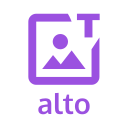

# alto - an accessibility browser add-on

## Add-on Installation Instructions

1. Download the .ZIP file of the code.

2. Open the Chrome browser and go to the extensions page, either by typing chrome://extensions/ into the address bar and hitting enter, or clicking on the extensions icon on the top right menu bar.

3. Enable Developer Mode by clicking the toggle switch in the top right corner of the page.

4. Click the "Load Unpacked" button and select the `chrome-extension` folder from the folder that you downloaded in step 1.

5. Chrome will now install the extension and you should see it listed on the extensions page.

6. To use the extension, click on the extension icon in the browser toolbar and pin it.

Congratulations, you have successfully installed the alto browser add-on!
Note: The alto add-on icon is where you can access the options menu.

## Quick Start

1. Go to any website with images (e.g.[Pexels](https://www.pexels.com/)).
2. The first five images originally lacking in alt text should have alt text generated provided the setting has been enabled in the alto popup options menu.
3. For images still lacking in alt text, you can right-click the image and select the option "Generate alt text for all images" in the context menu to generate the alt text.

## Backend Installation Instructions:
1. Run the command pipenv install to install the necessary dependencies for the project.
2. Obtain the .env file from another developer. This file should contain the necessary environment variables for the project, such as the API keys and endpoint URLs for the cognitive service instance.
3. To test locally, run the main.py script in the image-caption-service directory to start the service.
4. To test remotely, deploy the Azure Function using VSCode. This will allow the service to be accessed remotely through an HTTP trigger.
5. Test the Azure Function using the remote URL provided by Azure. This will allow you to verify that the function is working correctly and that the image-caption-service is able to generate captions for images as expected.
